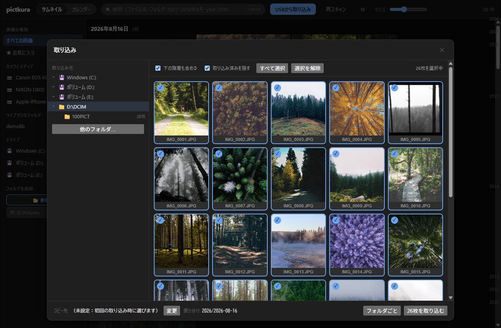
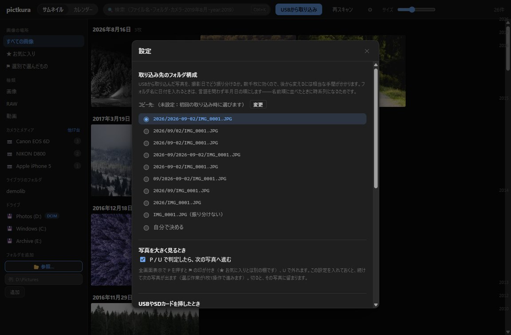
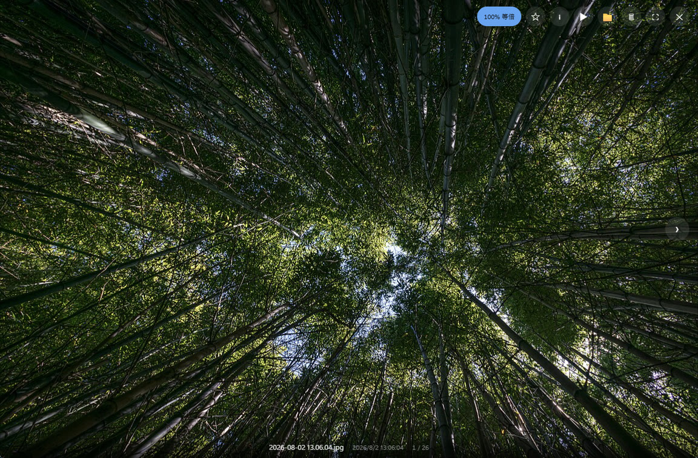

# pictkura

**日本語** ｜ [English](README.md)

**撮った写真の、最初の行き先。** 小さくて速い写真管理のデスクトップアプリです。得意な
ことは2つ。カメラのカードから取り込むことと、手元の写真を見ること。数万枚あっても
待たされないことを目標にしています。

`pictkura` は picture と「蔵」。写真を仕上げる工房ではなく、貯めておく場所という
意味で名付けました。RAW を見せても現像しないのは、そのためです
——[なぜ作ったのか](https://harusame64.github.io/pictkura/ja/about.html)。

**[紹介ページ](https://harusame64.github.io/pictkura/ja/)** ·
[アプリ仕様](https://harusame64.github.io/pictkura/ja/spec.html) ·
[インストール](https://harusame64.github.io/pictkura/ja/install.html) ·
[取扱説明書](https://harusame64.github.io/pictkura/manual.html) ·
[AlternativeTo](https://alternativeto.net/software/pictkura/about/) ·
[Softpedia](https://www.softpedia.com/get/Multimedia/Graphic/Digital-Photo-Tools/pictkura.shtml)


*→ で送りながら、⚑（採用）と ✕（ボツ）を付けているところ。3万枚のデモ用ライブラリで撮りました。*

## 目標

- **マルチOS対応** — Tauri v2（Windows / macOS / Linux）
- **カードから好きな場所へ取り込み** — 撮影日ごとのフォルダへ自動で振り分けます
- **待たされない表示** — 機能を最小限に絞り、その分を速さに充てています

---

## 入手とインストール

最新版は [Releases](https://github.com/Harusame64/pictkura/releases) から入手できます。

| 対象 | ファイル | 備考 |
|---|---|---|
| **Windows 10/11（x64）・おすすめ** | `pictkura_<バージョン>_x64-setup.exe` | **管理者権限は不要です**。自分のユーザーにだけインストールされます（`%LOCALAPPDATA%\pictkura`）。最初に日本語か英語を選べます |
| **Windows・PC全体へ入れる（企業などの管理者向け）** | `pictkura_<バージョン>_x64_<言語>.msi` | PC全体にインストールする場合。**管理者権限を求められます**。日本語版と英語版は別のファイルです |
| **Windows・インストール不要** | `pictkura_<バージョン>_x64-portable.zip` | 展開して `pictkura.exe` を実行するだけ |
| **macOS 11以降（Apple Silicon）** | `pictkura_<バージョン>_arm64.zip` | 展開して `pictkura.app` を好きな場所へ。**初回起動の前に下の注意を読んでください** |

Windows では **WebView2 ランタイム**も必要です（Windows 11 と、更新済みの
Windows 10 には最初から入っています）。

> **MSI版から `-setup.exe` へ乗り換えるときは、手で消す必要はありません。**
> `-setup.exe` はMSI版が入っていることを見つけると、**先にMSI版を削除してから**
> インストールします。MSIの削除はPC全体に関わる操作なので、**そこだけ管理者の許可
> （UAC）を求められます**。
>
> **1台を複数人で使っている場合は注意してください。** MSI版はPC全体
> （`Program Files`）に入っているため、削除した時点で**ほかの利用者も pictkura を
> 使えなくなります**。`-setup.exe` が入れる先は実行した利用者のプロファイル内
> （`%LOCALAPPDATA%\pictkura`）で、ほかの利用者には引き継がれません。
> 使う人それぞれが `-setup.exe` を実行してください。
> また、ほかの利用者が一度でも起動していた場合、**その人の環境には自動再生の候補
> だけが残ります**。その人に、pictkura を入れ直して設定の「USBやSDカードを挿したとき」を
> オフにしてもらうか、入れ直さないなら Windows の設定で自動再生の既定を選び直して
> もらってください。
>
> 逆向き（`-setup.exe` を入れた状態でMSIを入れる）には対応していないので、
> 先に「設定 → アプリ」からアンインストールしてください。

### Windows は署名していないので警告が出ます

pictkura は **Windows のコード署名を受けていません**（証明書が有料のためです）。
アプリが壊れているわけではありませんが、次のようなセキュリティ警告が出ます。
進めれば問題なく使えます。このうち SmartScreen の警告は、**新しいバージョンを
ダウンロードするたびに**また出ることがあります。

**`-setup.exe`（おすすめ）でインストールするとき**

出るのは **SmartScreen だけ**です（「**WindowsによってPCが保護されました**」→
「**詳細情報**」→「**実行**」）。**UAC は出ません**——PC全体ではなく自分のユーザーに
だけインストールするので、管理者の許可が要らないためです。

**例外が2つあります**。どちらも「PC全体に関わる作業を代行する」ときです:

1. 以前の**MSI版が入っている場合**、`-setup.exe` はそれを先に削除してから
   インストールします。**その1回だけ UAC が出ます**（次回からは出ません）
2. **WebView2 ランタイムが入っていないPC**では、インストーラが WebView2 を
   ダウンロードしてインストールしようとします。WebView2 はPC全体に入るものなので、
   ここでも UAC が出ます（Windows 11 と更新済みの Windows 10 には最初から
   入っているので、普通は出ません）

**MSI でインストールするとき**（UAC も出ます）

1. **SmartScreen**（ダウンロードした MSI を**開いたとき**に出ます。ダウンロードした
   時点では出ません）: 「**WindowsによってPCが保護されました**」と表示されることが
   あります。「**詳細情報**」を押すと「**実行**」ボタンが現れるので、それで進みます。
   SmartScreen は**ダウンロードしたファイルごと**に判断するので、一度通しても次の
   バージョンではまた出ますし、同じファイルでも別のPCでは出ます。ただし同じPCの
   同じファイルなら、一度実行すればたいてい次からは出ません。
2. **ユーザーアカウント制御（UAC）**: 続けて「**この不明な発行元からのアプリが**デバイスに
   変更を加えることを許可しますか?」と聞かれ、**発行元が「不明」**と黄色く出ます（署名が
   無いため）。「**はい**」で進みます。この確認は**インストールのたび**に出ます。

**ポータブル ZIP 版のとき**

インストールは不要ですが、展開した `pictkura.exe` を**初めて実行するとき**に、
上と同じ **SmartScreen**（「WindowsによってPCが保護されました」）が出ることがあります。
「**詳細情報**」→「**実行**」で進みます。

**共通: スマートアプリコントロール**

**スマートアプリコントロール**が有効な場合（Windows 11 をクリーンインストールすると
有効なことがあります）、署名の無いアプリは「実行」ボタンすら出ないまま**拒否される**
ことがあります。これは**どの入手方法でも同じ**です（届き方ではなくコード自体を
見るためです）。アプリ側で回避する手立ては無く、有効になっていないPCを使うか、
署名版を待つことになります。オフにすれば通るようになりますが、**一度オフにすると
元に戻せません**（Windows を入れ直すまで再有効化できません）ので、このアプリのために
オフにすることはおすすめしません。

> 署名（Authenticode）をすれば「**発行元: 不明**」は発行元名に確実に変わり、SmartScreen も
> 出にくくなります。ただし**必ず消えるわけではありません** — 署名したての、まだ評価の
> 溜まっていないファイルは依然として警告されることがあります（MSI の UAC の確認自体は、
> 署名の有無にかかわらずインストールのたびに残ります）。証明書が有料のため **v0.1 では
> 見送っています**。macOS 版も同じく署名していません（下記）。

<!-- 解決済み。次の版を切るときに、この段落・README.md の同じ段落・
     docs/{ja,en}/install.html の 2.5 節と目次の行を、まとめて消すこと -->
**Defender の隔離は解決しました（2026-09-03）**

0.2.6 の `pictkura.exe` が `Trojan:Win32/Bearfoos.A!ml` として隔離される例がありました。
末尾の `!ml` は**機械学習による推定**で、中身を特定の脅威と照合した結果ではなく、署名の
無い実行ファイルに出やすい判定です。**2026-09-02** に Microsoft へ誤検知として報告し、**翌 2026-09-03 に
検出が取り下げられました**——マルウェアの基準を満たさない、という回答です。定義が古いまま
の機械では、まだ隔離されることがあります。その場合は**管理者として実行した**コマンド
プロンプトで:

```
cd /d "c:\Program Files\Windows Defender"
MpCmdRun.exe -removedefinitions -dynamicsignatures
MpCmdRun.exe -SignatureUpdate
```

上は**コマンドプロンプト**（`cmd.exe`）の書き方です。`/d` は、**別のドライブに居るときに
`cd` が `C:` へ渡る**ために要ります。**PowerShell では `/d` を外し**、残り2行を
`.\MpCmdRun.exe` と書いてください（現在のディレクトリを探しに行かないため）。

定義を更新すれば検出は止まりますが、**すでに持っていかれたファイルは戻りません**。
**定義を新しくしたうえで pictkura を入れ直せば、実体が戻ります**——これが一番早い方法です
（*先に*入れ直しても、入れ直したものがまた持っていかれます）。隔離された分は、
Windows セキュリティの**保護の履歴**にも残っています。

経緯は [issue #105](https://github.com/Harusame64/pictkura/issues/105) にまとめてあります。

### macOS は初回だけ開き方に手順が要ります

macOS版は **Appleの開発者署名（Developer ID）を受けていません**。そのため初回は
ダブルクリックしても起動せず、Gatekeeper に止められます。アプリが壊れているわけでは
なく、Gatekeeper は「誰が署名したのか確かめられない」と言っています。

**まず `pictkura.app` を「アプリケーション」フォルダなど、置いておきたい場所へ移して
ください。** これは省略できません。移さずに起動すると、macOS はアプリを読み取り専用の
一時領域へコピーして実行します（App Translocation）。

そのうえで、**お使いの macOS のバージョンによって手順が違います**。

#### macOS 15（Sequoia）以降

ダブルクリックすると、こう表示されます。

```
"pictkura" は開いていません

Apple は、"pictkura" に Mac に損害を与えたり、プライバシーを侵害する
可能性のあるマルウェアが含まれていないことを検証できませんでした。

    ［ゴミ箱に入れる］  ［完了］
```

このダイアログに先へ進むボタンはありません。次の手順で開きます。

1. ［**完了**］を押す
2. **システム設定** →「**プライバシーとセキュリティ**」を開き、**下の方までスクロール**する
3. `pictkura` がブロックされた旨の行にある「**このまま開く**」を押す
4. パスワードを求められたら入力する。アプリが起動します

手順2の行は、**一度ダブルクリックして弾かれたあとにしか現れません**。
順番どおりに進めてください。

#### macOS 11〜14

`pictkura.app` を**右クリック**（またはcontrol＋クリック）→「**開く**」→ 確認で「**開く**」。

> この抜け道は **macOS 15 で廃止されました**。逆に、macOS 15 以降を前提に書かれた
> 「システム設定」の手順は、画面の名前が違う macOS 11〜12 には当てはまりません。
> お使いのバージョンに合った方を見てください。

#### どのバージョンでも使える方法（ターミナル）

```
xattr -dr com.apple.quarantine /パス/pictkura.app
```

---

手順が要るのは初回だけです。2回目からは普通にダブルクリックで開きます。
なお**この表示は配布形式が `.zip` でも `.dmg` でも同じ**で、形式を変えても回避できません。

Intel（x86_64）版と Linux 版はありません。

### 配布物を自分で確かめる

署名の証明書を持っていないので、**配布者が「安全です」と述べても、受け取る側に
それを確かめる手立てがありません**。代わりに材料を出します。

- **ソース**は全部あります。配布物は[タグごと](https://github.com/Harusame64/pictkura/tags)に、
  その時点のソースから作られます
- **作っているのは手元の機械ではありません。**
  [GitHub Actions のワークフロー](.github/workflows/release.yml)が5つのファイルを作り、
  [走った記録](https://github.com/Harusame64/pictkura/actions/workflows/release.yml)も残ります
- **ダイジェストは GitHub 自身が出します。** 下のコマンドで返る SHA-256 は、
  GitHub が保管しているバイト列から GitHub が計算した値で、こちらが書いた数字ではありません

`v0.2.4` は例です。**落とした版のタグに読み替えてください**（ファイル名に入っています）。
よその場所から落としたものは最新版とは限らないので、`latest` と見比べないこと。

macOS:

```sh
# GitHub が持っているダイジェストを見る
curl -s https://api.github.com/repos/Harusame64/pictkura/releases/tags/v0.2.4 | grep -E '"name"|"digest"'

# 落としたファイルのダイジェストを出して、上と見比べる
cd ~/Downloads
shasum -a 256 pictkura_*_arm64.zip
```

Windows（PowerShell。`grep` が無く、Windows PowerShell 5.1 では `curl` が
`Invoke-WebRequest` の別名なので `-s` を受け付けません）:

```powershell
(Invoke-RestMethod https://api.github.com/repos/Harusame64/pictkura/releases/tags/v0.2.4).assets | Select-Object name, digest

cd ~\Downloads
Get-FileHash .\pictkura_*_x64-setup.exe -Algorithm SHA256
```

GitHub は `sha256:` を付けて返し、`Get-FileHash` は大文字で返します。前置きを外し、
大文字小文字を無視して見比べてください。**Windows で何も表示されないときは、その
フォルダにファイルが無いという意味です** — `Get-FileHash` は当たるファイルが1つも
無いと、エラーを出さずに黙って終わります（PowerShell 7.6.5 で実測）。

これで分かるのは、**手元のファイルが配っているものと同じバイト列か**だけです。
**中身が安全であることの証明にはなりません。** Softpedia のような別の場所から
落としたときにこそ効きます。

---

## 使い方

### 1. ライブラリのフォルダを登録する

初回起動したら、左ペイン下部の「**フォルダを追加**」に写真のあるフォルダを指定して
「追加」を押します。ドライブの一覧からも選べます。登録するとすぐに走査が始まり、
日付ごとに並んだ一覧ができあがります。

> 2回目以降の起動では、NTFSの変更ジャーナルを読んで**前回以降に変わったファイルだけ**を
> 確認します（画面下の中央に ⚡ の帯が数秒だけ出て、どれだけ省けたかが分かります）。

### 2. USB / SDカードから取り込む



上部の「**USBから取り込み**」を押します。左で取り込み元のフォルダを選ぶと、
中の写真が右に並びます。

- **下の階層も含める** … DCIM の下に日付フォルダが切られていても、まとめて拾います
- **取り込み済みを隠す** … 取り込みと同じ判定でコピー先を照合し、既にあるものを伏せます
- **コピー先** … 下部の「変更」から、任意のフォルダを指定できます
- **振り分け** … 撮影日をもとに、下で決めたフォルダ構成へ自動で振り分けます

コピー中は進捗・残り時間・**いまコピーしている写真**を表示します。
1枚コピーするごとに、元とサイズが一致するかを確かめます。

### 3. 取り込み先のフォルダ構成を決める



⚙（設定）→「取り込み先のフォルダ構成」。9種類の候補から選ぶか、
「**自分で決める**」で自由に書けます。

| 書けるもの | 置き換わるもの |
|---|---|
| `{year}` | 4桁の年（`2026`） |
| `{month}` | 2桁の月（`08`） |
| `{day}` | 2桁の日（`13`） |
| `/` | フォルダの階層 |

入力すると**実際にできるフォルダ名**がその場に出ます。`..` や絶対パス、
ファイル名に使えない文字は自動で取り除くので、何を書いてもコピー先の外に
書き出されることはありません。

**用意している候補では**、フォルダ名の日付はどの言語でも年から始まる並びです。
名前順に並べるとそのまま時系列になるためです。年のフォルダを自分で管理している
場合は、コピー先にその年のフォルダを指定したうえで、`2026-08-16/` だけを足す
候補を選んでください。

> **写真に付いているファイルも一緒に運びます。** 現像ソフトが書いた `.xmp`
> （現像設定・評価・キーワード）のように、写真の隣に同じ名前で置かれるものは、
> 取り込み・フォルダへの移動やコピー・ゴミ箱送りのいずれでも一緒に動きます。
> 既定は `.xmp` `.aae` `.dop` `.pp3` `.on1` の5つで、`pictkura.toml` の
> `[import] sidecar_extensions` で足したり空にしたりできます。
> `.thm` `.lrv` `.modd` `.moff` `.wav` は既定では運びません（カメラが作り直せるもの、
> 他のアプリの管理ファイル、同名の別物を巻き込みやすいもの）。
>
> **RAWとJPEGを同時に撮っている**場合、`IMG_0001.CR3` と `IMG_0001.JPG` は
> **片方だけ撮影日時を持たないときも**同じ日のフォルダへ入ります（日時を持つ側に
> 合わせます。どちらも持たないときは、それぞれのファイルの更新日時によります）。

### 4. 探す

上部の検索ボックス、または **Ctrl + K** のコマンドパレットから絞り込みます。

| 入力 | 意味 |
|---|---|
| `沖縄` | ファイル名・フォルダ名・カメラ名の部分一致（日本語は中間一致） |
| `camera:α7` | カメラで絞り込む（左ペインの「カメラとメディア」と同じ） |
| `folder:旅行` | フォルダ名で絞り込む |
| `2019年` / `2019-08` / `2019年8月11日` | 撮影日で絞り込む。**単位も区切りも無い `2019` は文字列として扱います**——ファイル名と見分けが付かないためです |
| `year:2019` / `年:2019` | 年だけで絞り込む |
| `★` | お気に入りだけ |
| `⚑` / `pick:` | 選別で選んだものだけ |

条件はすべてANDで、結果は撮影日の新しい順に並びます。

### 5. 見る



タイルをクリックすると原寸のビューアが開きます。

| キー | 動き |
|---|---|
| `←` `→` | 前後の写真へ |
| `P` / `U` | 選ぶ（⚑を付ける）／この写真への判定を取り消す（⚑と✕を外す）。既定では**押すと次の写真へ進みます**（設定で切れます） |
| `X` | ボツの候補にする（✕）。押した時点では**何も消えません**——ビューアを閉じるときに対象を並べて見せるので、そこで確かめてからまとめてゴミ箱へ送ります |
| `Space` | スライドショー（動画のときは再生／一時停止） |
| `I` | 撮影情報（カメラ・レンズ・絞り・シャッター・ISO・GPS） |
| `F11` | 全画面 |
| `Esc` | 閉じる |
| `?` | ショートカット一覧を出す（どの画面からでも） |

マウスを止めると操作パネルが自動で消え、動かすと戻ります。
右クリックで「開く／他のアプリで開く／場所を表示／ゴミ箱へ」。
**削除は必ずゴミ箱経由**で、ファイルを直接消すことはありません。

### 6. まとめて選ぶ

タイルにマウスを重ねると角に丸が現れます。これを押すか、`Ctrl` を押しながらタイルを
クリック（macOS は `⌘`）すると選択が始まり、画面の上に選択バーが出ます。

| 操作 | 動き |
|---|---|
| 丸／`Ctrl` + クリック | 1枚を選ぶ・外す |
| `Shift` + クリック | 最後に押したタイルからここまでをまとめて選ぶ。**まだスクロールしていない日も含まれます** |
| 日付の見出しを押す | その日を全部選ぶ。もう一度押すと外す |
| `Ctrl` + `A` | いまの検索と ★ / ⚑ の絞り込みに一致するもの全部 |
| `Esc` | 選択をやめる |

選択中は、ふつうのクリックがビューアを開くのではなく選択の入れ替えになります。
バーからは、選択した写真の ★ の付け外し、指定したフォルダへのコピー・移動、
まとめてゴミ箱へ移動ができます。削除は確認してから実行し、**この場合も
ゴミ箱経由**です。

**選んだ写真を見る**を押すと、選んだ写真だけをビューアで順に送れます。`←` `→` は
その中だけを移動し、下の字幕にある枚数も選んだ数になります。連写から1枚を選ぶ作業は、
`P` と `→`（自動送りが入っていれば `P` だけ）で最後まで進みます。

⚑ の印は **★ お気に入りとは別の棚**です。★は「あとで見返したい写真」、⚑は
「この連写から残す1枚」——混ぜると、選別のたびにお気に入りが選別の残りで
埋まってしまうためです。左の **⚑ 選別で選んだもの** から選んだ写真だけを
一覧でき、検索ボックスでは `⚑`（または `pick:`）でも絞れます。

**フォルダへコピー／フォルダへ移動**は、選んだファイルを指定したフォルダへ
**そのまま置きます**（日付のフォルダは作りません）。何枚か人に渡す、USBメモリへ
入れる、といった用途向けです。同じものが既にあれば何もしないので
（名前・サイズ・更新日時で判断します）、同じフォルダへ何度書き出しても増えません。
名前が同じでも中身が違うときは `-1`, `-2` を付けて避けます。移動は確認してから
実行し、**その写真は元の場所から無くなり、ライブラリからも外れます**（★と⚑の印は
引き継がれません）。別のドライブへ移すとき、およびクラウドにしか実体が無いファイルを
移すときは、コピーしてから元をゴミ箱へ送ります。

選択は画面に出ているものに追従します。検索や ★ / ⚑ の絞り込みを変えたり、カレンダー表示へ
切り替えたりすると選択は解除されるので、**見えていない写真に一括操作が効くことはありません**。

### 7. 表示言語

OSの優先言語に従います。対応する言語が無い場合は英語です。⚙（設定）→「**言語**」で
明示的に選べます（切り替えると画面を読み込み直します）。

取扱説明書はアプリに同梱しており、⚙（設定）→「**取扱説明書**」から開けます。
ブラウザでも読めます → **[harusame64.github.io/pictkura/manual.html](https://harusame64.github.io/pictkura/manual.html)**。
このリポジトリでは `docs/manual.html` と `docs/manual.en.html` にあります
（GitHubではHTMLのソースが表示されます）。

> ひとつだけ日本語のままのものがあります。Windowsの「自動再生」に出る項目は、
> 表示言語によらず「pictkura で写真を取り込む」です。

### 8. 新しいバージョンのお知らせ

起動して数秒たつと、新しいバージョンが出ていないかを1日1回だけ確認します。出ていれば
画面の下に控えめな行が現れ、押すとダウンロードページがブラウザで開きます。
**アプリが自動的に更新されることはありません。**

これが**このアプリの唯一の外向き通信**です。送るのは「pictkura のバージョン◯◯が
確認しています」という名乗りだけで、写真もファイル名もフォルダの場所も送りません。
⚙（設定）→「**このアプリについて**」→「起動時に新しいバージョンを確認する」をオフにすると、
pictkura は一切外へ出ません（同じ場所の「更新を確認」を押したときだけ確認します）。

---

## 対応しているファイル形式

「**一覧**」はサムネイルが並ぶかどうか、「**表示**」はビューアで原寸を見られるか
どうかです。

### 写真

| 形式 | 一覧 | 表示 | 備考 |
|---|:--:|:--:|---|
| `jpg` `jpeg` | ✅ | ✅ | 縮小しながら展開するので大きい写真でも速い |
| `png` `webp` | ✅ | ✅ | |
| `avif` | ✅ | ✅ | デコーダ（rav1d）を同梱。OSの拡張機能は不要 |
| `heic` `heif` `hif` | ✅ | ✅ | iPhoneの既定形式。**画素の展開はOS任せ**（下の注意事項） |
| `bmp` `gif` `tif` `tiff` | ✅ | ✅ | tiff はブラウザが描けないので、表示用にJPEGへ詰め直します |
| `svg` | ✅ | ✅ | サムネイルを作らず原本をそのまま描画（拡大しても劣化しません） |

### RAW（現像はしません）

pictkura は RAW を**現像しません**。カメラが背面液晶での確認用に埋め込んだ
表示用JPEGを、そのまま取り出して使います。現像しない分速く、色もカメラが
出したものになります。

`cr2` `cr3` `crw` `nef` `nrw` `arw` `srf` `sr2` `arq` `raf` `orf` `ori` `rw2` `pef`
`ptx` `srw` `dng` `raw` `rwl` `3fr` `fff` `iiq` `erf` `mrw` `x3f` `dcr` `kdc` `mos`

**取り出せる表示用JPEGがあるかどうかを決めているのはカメラで、こちらではありません。**
しかも同じ拡張子でも機種で割れます。これらの拡張子を持つ実ファイル1,831枚のうち、
**1,680枚から絵が出て、うち1,495枚が原寸**でした。`rw2` `cr3` `pef` `srw` `rwl` `x3f`
`nrw` `ori` は**全枚数で原寸のプレビューが出て**、`crw` `raw` `mrw` `dcr` は**多くが
プレビューを持たず**、`dng` は三方に割れています。
**[あなたのカメラは入っていますか](https://harusame64.github.io/pictkura/ja/cameras.html)**
——メーカー67社・925機種を1行ずつ、測った実物へのリンクつきで並べてあります。

先に知っておくとよいことが1つ。**`.ori` はハイレゾ撮影を二重に見せます。**
OM System の機種は1回のシャッターで `.ORF`・`.ORI`・`.JPG` の**3本をカードに書く**ので、
1枚のハイレゾ撮影がタイル3つを占めます。**カードに在るファイルを隠すほうが悪い**、という判断です。

2026-09-04 に、**実ファイル1,870枚**——[raw.pixls.us](https://raw.pixls.us/) の
CC0サンプル全件——で測りました。macOSで816枚・Windowsで1,054枚、**パニックは0件**。
**数えた絵はすべて実際に展開しています**——JPEGのヘッダから寸法を読んだだけの数ではありません。

Apple ProRAW（実体はDNG）にも対応しています。iPhone 12 Pro の実ファイルで、
フル解像度 4032×3024 の表示用JPEGを 21ms で取り出せることを確認しました。

### 動画

| 形式 | 一覧 | アプリ内再生 | 備考 |
|---|:--:|:--:|---|
| `mp4` `m4v` `mov` `webm` | ✅ | ✅ | コーデックはOS依存（HEVCは下の注意事項） |
| `avi` `mts` `m2ts` `mkv` `3gp` `wmv` `mpg` `mpeg` | ✅ | ❌ | 再生は「既定のアプリで開く」へ |

**一覧に並ぶこと自体は、どのOSでも同じです。** 変わるのは**サムネイルが付くかどうか**で、
上の表の一覧欄の ✅ はWindowsで確認した範囲です。さらにそのサムネイルは、pictkura が作るものではなく
**OS から取得できたものに限られます**。裏側はこうなっています。

- **サムネイル**はOSから借りるので、**そのOSがコンテナを開ける範囲までが上限**です。
  **Windows** はエクスプローラと同じシェルの経路で、`.avi` とHEVCの `.mov` はサムネイルが返ることを
  実測済み、`.m2ts` は未確認のままです。OSに対応する部品もコーデックも無ければ何も返りません。
  なおHEVCを測った機械には下に書いた有料の拡張機能が入っており、**外した状態では試していません**。
  **macOS** は AVFoundation で、上のコンテナを全部渡したうえで**開けたものだけ**が返ります
  ——`mp4` と `mov` は、H.264 でも HEVC（`hvc1`＝iPhoneと同じ綴り）でもサムネイルが出ることを
  実測済みです。ただし**HEVCの見本はmacOS自身で変換したもので、携帯電話が書いた実物では
  ありません**。`.avi` は何も返らないことを実測済みです。
  **ここに名前の挙がっていないものは、どちらのOSでも未測定**で、出る可能性はありますが
  約束はできません。**Linux** は経路そのものがありません。
- **長さ・寸法・撮影日時**は、`mp4` `m4v` `mov` `3gp` の4つだけコンテナのヘッダから読みます
  （画素は1バイトも読みません）。1行目にある `webm` はこの4つに入らず、逆に2行目にある
  `3gp` は入ります。ヘッダから読めなかったものは **Windows** ではシェルに聞きます。
  残りのコンテナもシェルだけが頼りで、**実測したのは合成した `.m2ts` の1件**
  （長さも寸法も返りました）、他は測っていません。**macOS** と **Linux** には
  その後ろ盾が無いので、この4つ以外は長さも寸法も出ず、日付はファイル名か更新日時に落ちます。

---

## 注意事項・既知の穴

| 事柄 | 内容 |
|---|---|
| **クラウドにしか実体が無いファイル** | OneDrive等の「オンラインのみ」ファイルを、**pictkura が先回りしてダウンロードすることはありません**。一覧には出て、寸法と撮影日時はOSが持っているぶんを使います——この後ろ盾はWindowsのシェルなので**Windowsだけ**です（長さはそちらでも取れません）。その写真を実際に見に行ったとき——一覧でタイルが画面に映ったときや、ビューアで開いたとき——に初めて実体を取りに行きます |
| **HEIC / HEVC にOSの部品が要るのはWindowsだけ** | **HEVCのデコーダは同梱しません**——配布には特許の許諾が要るので、OSが持っているものを使う方針です。そのため **Windows** では「HEIF Image Extensions」（無料）に加え、画素の展開に「HEVC Video Extensions」（有料・数百円）を入れるまでHEICの画像が出ません。**macOSは入れるものがありません**——ImageIOもHEVCのデコーダもOSに同梱されています。**Linux** は経路がまだありません |
| **動画のサムネイルは、OSがコンテナを開ける範囲まで** | **Windows** はシェルから借ります——`.avi` とHEVCの `.mov` は出ることを実測済み、`.m2ts` は未確認、OSに部品もコーデックも無いものは何も返りません。**macOS** は AVFoundation から借ります——`mp4` と `mov` はH.264とHEVC（`hvc1`）の見本で出ることを実測済み、`.avi` は出ないことを実測済みで、他のコンテナは未測定です。**Linux**（各ディストリのサムネイラ）は経路そのものがありません |
| **`mp4` `m4v` `mov` `3gp` 以外の長さ・寸法** | この4つはコンテナのヘッダから直接読みます。読めなかったものは **Windows** ではシェルに聞きます。残りのコンテナもシェルだけが頼りで、実測したのは合成した `.m2ts` の1件、他は測っていません。**macOS**・**Linux** にはその後ろ盾が無いので、この4つ以外は長さも寸法も出ず、日付はファイル名か更新日時に落ちます |
| **`.m2ts` / `.avi` はアプリ内で再生できない** | 表示に使っているブラウザ部品が、これらのコンテナを扱えないためです。一覧には出ます |
| **撮影日時の決め方** | EXIF → OSのプロパティ → **ファイル名の日付** → ファイルの更新日時、の順です。EXIFを持たない保存画像（スクリーンショット等）でも、名前に日時があれば正しい日に並びます。**画像を作れないファイル**（使えるプレビューを持たないRAW等）では、**既に記録してある日付**をファイル名や更新日時より先に見ます——記録してあるのが更新日時そのもの（まだ何も読めていない印）のときを除きます。**寸法がまったく入らないファイルは起動のたびに調べ直される**ので、何も読めなかった回に取り込んだ日へ戻らないようにするためです |
| **どこにも寸法を申告していないRAWは寸法が出ない** | 寸法は、ファイル自身の申告か、Panasonic系のRAW（`rw2`・`raw`・`rwl`。同じ作りのLeicaを含みます）に入っているセンサーの縁か、埋め込みプレビューから決まります。そのどれも無いRAW——見本では Blackmagic の CinemaDNG——は一覧で寸法が空のままになり、起動のたびに聞き直されます。例外は**Windowsでクラウドにしか実体が無いファイル**で、そちらは実体を落とさずにシェルが寸法を返します |
| **検索索引の再構築UIが無い** | 索引が壊れた場合は設定フォルダの `pictkura.db` を消して作り直してください（サムネイルも作り直しになります） |
| **検索結果の並び替えが無い** | 撮影日の降順で固定です |
| **取り込みの中断ができない** | 開始したら最後まで走ります |
| **RTL言語（アラビア語等）のレイアウト** | 未対応です |

---

## 速さのための設計

| 原則 | 実装 |
|---|---|
| 更新の検知はサイズと更新日時だけ | ファイルのハッシュは決して取らない（`scanner.rs`） |
| Base64を使わない | `media://` カスタムプロトコルで画像バイナリを直接ストリーミング |
| DOMを増やさない | TanStack Virtual による仮想スクロール |
| 書き込みを速く | SQLite WALモード＋トランザクションのバッチINSERT |
| レイアウトをずらさない | 画像の幅・高さをDBに保存し、描画前に枠を確保 |
| 最初の1枚をすぐ出す | EXIF埋め込みサムネイルを再エンコードなしで採用 |
| スクロールした先を空白にしない | 可視領域のIDを優先するサムネイル生成キュー |
| 走査中も配信を止めない | ディレクトリスキャンはDBロックの外で実行 |
| 起動時に全件を送らない | 「日付→枚数」の索引＋可視日だけの取得（スパースタイムライン） |
| 起動時にファイルを歩かない | NTFS USNジャーナルで前回以降の変更だけを取得 |
| 検索は必ずインデックスシーク | FTS5全文索引。日本語はCJKをbigram展開して中間一致（「旅行」で「沖縄旅行」が引ける） |
| RAWを現像しない | カメラが埋め込んだ表示用JPEGを取り出して使う |
| サムネイル生成はSIMDで | 縮小は `fast_image_resize`、JPEGは間引きながら展開（合わせて2.5倍） |
| クラウドのファイルを落とさない | 素性はOSのプロパティから借りる（実測: 3,166件を20秒・通信ゼロ） |

---

## 構成

```
crates/pictkura-core/   コアライブラリ（Config / スキャナー / DB / 取り込み / サムネイル / 検索）
src-tauri/              Tauriアプリ本体（コマンド・media://プロトコル）
ui/                     フロントエンド（React + Vite + TanStack Virtual）
docs/                   取扱説明書（日英）とスクリーンショット
```

開発日誌（`plan.md`）は非公開の別リポジトリに置いています。ソース中のコメントに
ある「`plan.md` 第3部」などの参照先は、このリポジトリには入っていません。

## 開発

### ビルドに要るもの

Rust とは別に、**Cコンパイラ**と **NASM** が要ります。

- **Cコンパイラ**: SQLite（`rusqlite` の bundled）・libwebp・libjpeg-turbo を
  ソースからビルドするため。Windows の GNU ターゲットなら MinGW-w64 の `gcc`
- **NASM**: rav1d（AVIF）と libjpeg-turbo のアセンブリ。
  **外すと6倍遅くなる**ので外さないでください。NASMはx86のアセンブラなので、
  **Apple Silicon では要りません**（そちらは両ライブラリとも `.S` を clang に通します）

```bash
# コアのテスト
cargo test -p pictkura-core

# UIビルド → アプリ起動
npm --prefix ui install && npm --prefix ui run build
cargo run -p pictkura --release

# 合成データで大規模時の応答時間を計測（実画像なし）
cargo run --release --bin bench -- --count 1000000
```

### 配布物を作る

```powershell
# Windows: MSI（ja-JP / en-US）・NSISのインストーラ・持ち歩き版ZIP
pwsh tools/release.ps1
```

```bash
# macOS（Apple Silicon）: pictkura.app を収めたZIP
bash tools/release-macos.sh
```

どちらも UIビルド → バンドル の順に実行します。**UIのビルドを飛ばさない**ことが
要点です——`ui/dist` は生成物なので、飛ばすと古い画面がそのまま配布物へ入っても
気付けません。`cargo tauri build` には Tauri CLI が要ります
（`cargo install tauri-cli --version "^2.0"`）。

macOSのバンドル対象は `src-tauri/tauri.macos.conf.json` で決めています
（Tauriが `tauri.conf.json` へ自動で重ねます。既定の `msi` はmacOSでは作れません）。
`.app` は **ad-hoc署名だけ**で、Developer ID の署名も公証もしていません。
**ここは省くと壊れます**——arm64のリンカは実行ファイルに勝手にad-hoc署名を付けるので、
バンドル側を署名しないと「実行ファイルは署名済みなのにバンドルに `_CodeSignature` が無い」
という**未署名より悪い状態**になります。`signingIdentity: "-"` がそれを防いでいます。

`v*` のタグを push すると両方がCIで走り、5つのファイルがReleasesに付きます
（MSI×2・NSISのインストーラ・ポータブルZIP・macOSのZIP）。
**片方のOSだけでは公開しません**——両方の完了を待って5つ揃っているかを数える
ジョブを別に置いてあるので、片方が失敗しても「半分だけのリリース」は出ません。

設定は `%APPDATA%/dev.harusame.pictkura/pictkura.toml`（Windows）、
`~/Library/Application Support/dev.harusame.pictkura/`（macOS）に保存されます。
`[import]` `[routing]` `[library]` `[performance]` `[editors]` の構成です。

### OSSライセンス一覧を作り直す

依存を足したときは、同梱している `THIRD-PARTY-LICENSES.txt` を作り直してください。

```bash
cargo install cargo-about --features cli
cargo about generate about.hbs -o THIRD-PARTY-LICENSES.txt
node ui/scripts/licenses.mjs >> THIRD-PARTY-LICENSES.txt
```

## 品質ゲート

各マイルストーンで2段レビュー（Claude `/code-review` ＋ OpenAI Codex）を実施し、
確定した指摘を修正してからマージしています。

## ライセンス

pictkura は [MIT ライセンス](LICENSE) です。
同梱・利用しているサードパーティ製ソフトウェアの著作権表示とライセンス条文は
[THIRD-PARTY-LICENSES.txt](THIRD-PARTY-LICENSES.txt) にまとめてあります。

このREADMEのスクリーンショットに写っている写真は、Wikimedia Commons の
**CC0 / パブリックドメイン**の作品です（一覧は
[docs/images/SOURCES.tsv](docs/images/SOURCES.tsv)）。冒頭のGIFに写っている
写真も同じく Commons の CC0 作品で、こちらは撮影用に組んだデモ用ライブラリのものです。
