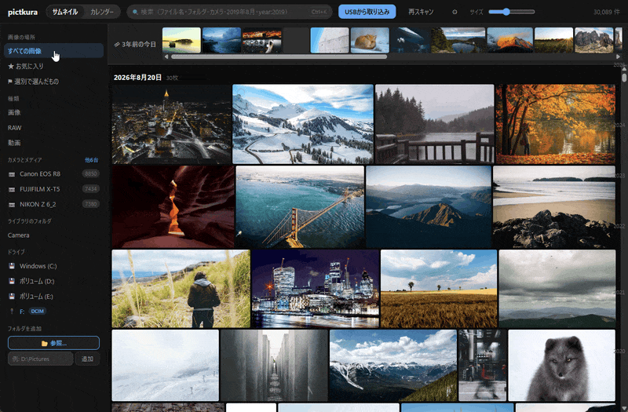
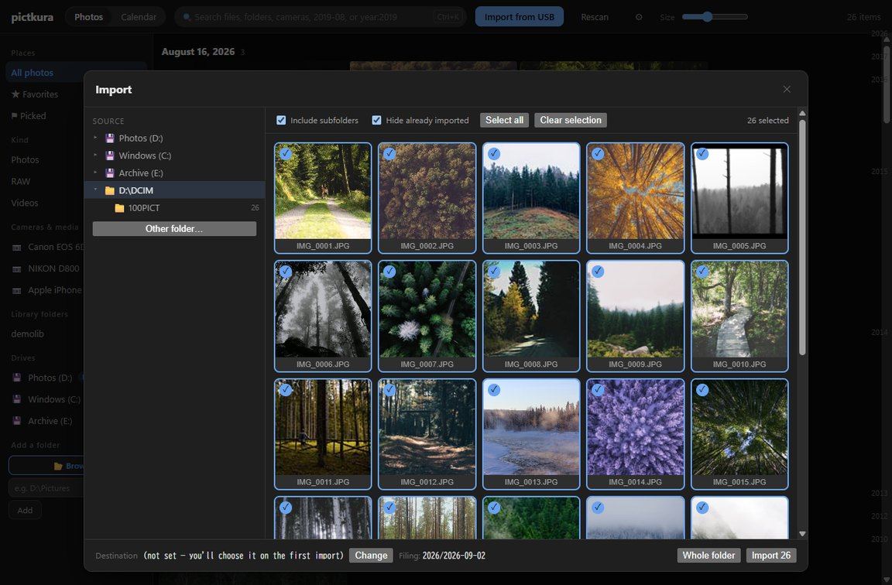
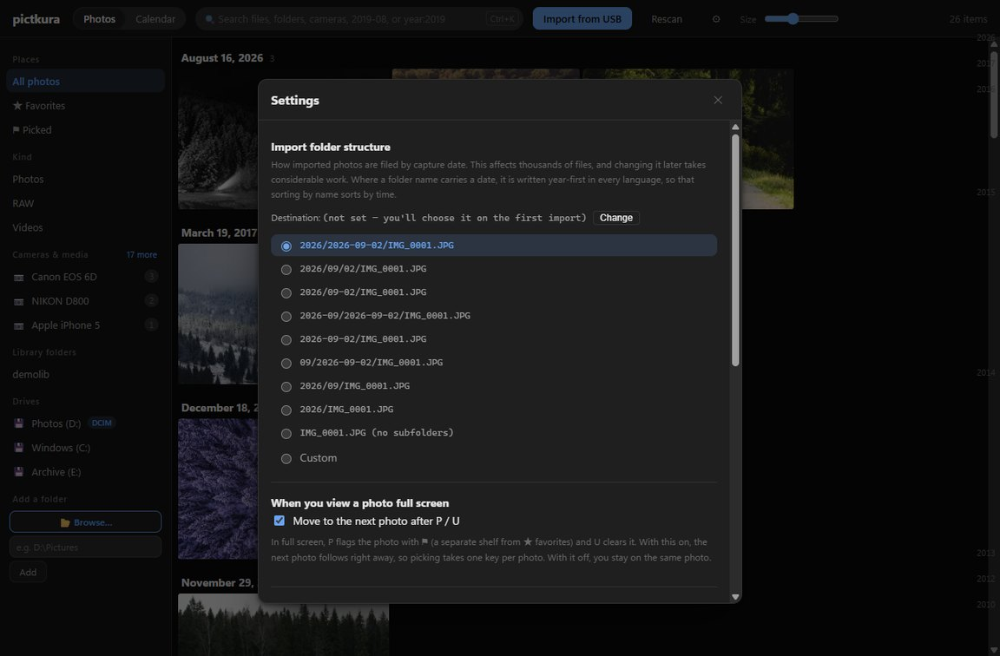
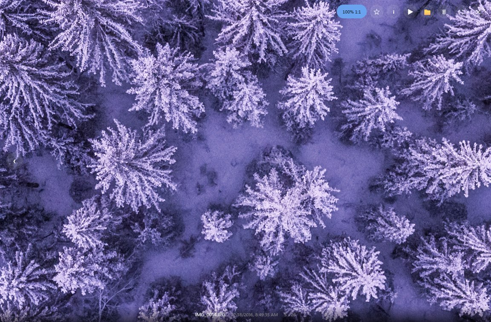

# pictkura

**English** ｜ [日本語](README.ja.md)

A small, fast desktop photo manager. It does two things well: importing from a camera
card and browsing what you already have — even when that is tens of thousands of files.

**[Website](https://harusame64.github.io/pictkura/en/)** ·
[Specification](https://harusame64.github.io/pictkura/en/spec.html) ·
[Installing](https://harusame64.github.io/pictkura/en/install.html) ·
[Manual](https://harusame64.github.io/pictkura/manual.en.html) ·
[AlternativeTo](https://alternativeto.net/software/pictkura/about/)



*Paging with → while marking ⚑ (pick) and ✕ (reject), recorded on a 30,000-photo demo
library. The screens are in Japanese; the app itself is in English as well.*

## Goals

- **Cross-platform** — Tauri v2 (Windows / macOS / Linux)
- **Import from a card to wherever you want** — sorted into folders by capture date
- **No waiting** — a deliberately small feature set, spent on speed instead

---

## Installing

Grab the latest build from [Releases](https://github.com/Harusame64/pictkura/releases).

| Platform | File | Notes |
|---|---|---|
| **Windows 10/11 (x64), recommended** | `pictkura_<version>_x64-setup.exe` | **No administrator rights needed.** Installs for your user only (`%LOCALAPPDATA%\pictkura`). Pick Japanese or English at the start |
| **Windows, machine-wide install (for administrators)** | `pictkura_<version>_x64_<lang>.msi` | For installing per-machine. **Asks for administrator rights.** Japanese and English installers are separate files |
| **Windows, no installer** | `pictkura_<version>_x64-portable.zip` | Unzip and run `pictkura.exe` |
| **macOS 11+ (Apple Silicon)** | `pictkura_<version>_arm64.zip` | Unzip and move `pictkura.app` wherever you like. **See the note below before the first launch** |

Windows also needs the **WebView2 runtime**, which is already present on Windows 11 and
on up-to-date Windows 10.

> **Moving from the MSI to `-setup.exe` needs no manual step.** When `-setup.exe` finds an
> existing MSI install, it **removes that first**, then installs. Removing the MSI touches the
> whole machine, so **that step asks for administrator approval (UAC)**.
>
> **Take care on a shared PC.** The MSI is installed for everyone, so switching **removes
> pictkura for the other users** (`-setup.exe` installs only for you). Each person should run
> `-setup.exe` themselves. Also, if another user had launched pictkura at least once, **their
> AutoPlay entry stays behind** — they can reinstall and turn off "When a USB drive or SD card
> is inserted" in Settings, or pick a new AutoPlay default in Windows Settings.
>
> The other direction (installing the MSI while `-setup.exe` is installed) is not handled, so
> uninstall from Settings → Apps first in that case.

### Windows shows warnings because the app is not signed

pictkura is **not code-signed on Windows** (a signing certificate costs money). Nothing is
broken, but you will see the security warnings below; just proceed and the app works normally.
**SmartScreen can appear for each version you download.**

**Installing `-setup.exe` (recommended)**

You only get **SmartScreen** ("**Windows protected your PC**" → **More info** → **Run
anyway**). **There is no UAC prompt**, because it installs into your own user profile rather
than the whole machine, so no administrator approval is required.

**Two exceptions**, both where it does something machine-wide on your behalf:

1. If an older **MSI install is present**, `-setup.exe` removes it before installing, and
   **that one step does prompt for UAC**. It will not prompt on later installs
2. On a PC **without the WebView2 runtime**, the installer fetches and installs it. WebView2 is
   machine-wide, so that prompts for UAC too (Windows 11 and up-to-date Windows 10 already
   have it, so normally this does not come up)

**Installing the MSI** (this one also prompts for UAC)

1. **SmartScreen** (when you open the downloaded MSI — not at download time): you may see
   "**Windows protected your PC**." Click **More info**, then the **Run anyway** button that
   appears. SmartScreen judges **each downloaded file**, so clearing one MSI does not cover the
   next release, and the same file can prompt again on another PC. Within one PC and one file,
   though, it usually stops asking after you've run it once.
2. **User Account Control (UAC)**: next, Windows asks whether to allow **an app from an unknown
   publisher** to make changes and shows **Publisher: Unknown** (because it isn't signed). Click
   **Yes**. This prompt appears **every time you install**.

**Portable ZIP**

No install is needed, but the **first time you run** the extracted `pictkura.exe`, the same
**SmartScreen** prompt ("Windows protected your PC") may appear. Click **More info** → **Run
anyway**.

**All of them: Smart App Control**

If **Smart App Control** is on — it can be, on a clean install of Windows 11 — it may block an
unsigned app **outright**, with no **Run anyway** to click. This applies to **every** download
here, since it judges the code, not how it reached you. There is no way around it
from the app's side: you would need a PC without SAC, or a signed build. Switching SAC off does
lift the block, but it is **one-way** — Windows cannot turn it back on without a reinstall — so
we don't suggest it just to run this app.

> Authenticode signing would reliably replace **"Publisher: Unknown"** with the publisher name,
> and makes SmartScreen fire less often — but it does **not** categorically remove it: a newly
> signed binary that hasn't built up reputation can still be flagged. (The MSI's UAC prompt
> itself still appears on every install either way.) The certificate is paid, so it is **deferred for
> v0.1**. The macOS build is likewise unsigned (below).

### macOS: the first launch needs a few extra steps

The macOS build is **not signed with an Apple Developer ID**, so Gatekeeper stops the
first launch. The app is neither damaged nor infected.

**First, move `pictkura.app` to wherever you want to keep it** (`/Applications`, say).
This is not just tidiness: launched from where it was unzipped, macOS copies the app
into a read-only temporary location and runs it from there (App Translocation).

After that, **the steps depend on your macOS version**.

#### macOS 15 (Sequoia) and later

Double-clicking shows a dialog saying macOS *"could not verify pictkura is free of
malware,"* offering only **Move to Trash** and **Done**. Nothing there lets you
continue, so:

1. Click **Done**.
2. Open **System Settings** → **Privacy & Security** and **scroll to the bottom**.
3. Find the line saying `pictkura` was blocked, and click **Open Anyway**.
4. Authenticate when asked. The app starts.

That line only appears *after* a blocked double-click, so keep the order.

#### macOS 11 to 14

**Right-click** (or control-click) `pictkura.app` → **Open** → **Open** in the dialog.

> **macOS 15 removed this bypass.** Conversely, the System Settings steps above do not
> apply to macOS 11–12, where that pane goes by a different name. Follow the section
> matching your version.

#### Any version (Terminal)

```
xattr -dr com.apple.quarantine /path/to/pictkura.app
```

---

Only the first launch needs this; afterwards it opens by double-clicking. The same
block happens whether the app ships as a `.zip` or a `.dmg` — the archive format has
nothing to do with it.

There is no Intel (x86_64) build, and no Linux build.

---

## Getting started

### 1. Add a folder to the library

On first launch, use **Add a folder** at the bottom of the left pane, or
pick one of the drives. Scanning starts immediately and the grid fills in by date.

> From the second launch onwards, pictkura reads the NTFS change journal and only visits
> **files that changed since last time**. The ⚡ in the top right shows how much it skipped.

### 2. Import from a card



Press **Import from USB**. Pick a source folder on the left and its
photos appear on the right.

- **Include subfolders** — picks things up even when DCIM has per-date folders inside
- **Hide already imported** — uses the same check as the importer, so what you see matches
- **Destination** — **Change** at the bottom takes any folder you like
- **Sorting** — files are filed by capture date using the folder pattern you chose

Progress, time remaining, and **the photo currently being copied** are shown while it runs.
File sizes are verified after each copy.

### 3. Choose how folders are named



⚙ (Settings) → **Import folder structure**. Pick one of nine presets, or choose
**Custom** and write your own.

| Token | Becomes |
|---|---|
| `{year}` | 4-digit year (`2026`) |
| `{month}` | 2-digit month (`08`) |
| `{day}` | 2-digit day (`13`) |
| `/` | a folder level |

The **resulting folder name** is shown as you type. `..`, absolute paths and characters
that are illegal in file names are stripped, so nothing can be written outside the
destination no matter what you type.

Where a folder name carries a date, it is written **year-first in every language**, so that
sorting by name sorts by time. If you keep the year folders yourself, point the destination
at that year's folder and pick the preset that adds only `2026-08-16/`.

> **Files that sit next to a photo travel with it.** A `.xmp` written by a raw developer
> (develop settings, ratings, keywords) shares the photo's name, and pictkura carries it
> along when importing, when copying or moving to a folder, and when sending the photo to
> the recycle bin. The default list is `.xmp` `.aae` `.dop` `.pp3` `.on1`; add to it — or
> empty it — via `[import] sidecar_extensions` in `pictkura.toml`. `.thm`, `.lrv`, `.modd`,
> `.moff` and `.wav` are **not** carried by default (the camera can regenerate them, they
> belong to another application, or the same name too easily means a different file).
>
> **If you shoot RAW+JPEG**, `IMG_0001.CR3` and `IMG_0001.JPG` land in the same date
> folder — one of the two sometimes carries no capture time.

### 4. Find things

Use the search box, or the command palette with **Ctrl + K**.

| Query | Meaning |
|---|---|
| `okinawa` | substring match on file name, folder name and camera |
| `camera:α7` | filter by camera (same as the left pane) |
| `folder:trip` | filter by folder name |
| `2019-08` / `2019-08-11` | filter by capture date. **A bare `2019` is treated as text**, not a date — it cannot be told apart from a file name |
| `year:2019` | filter to a single year |
| `★` | favourites only |
| `⚑` / `pick:` | picked photos only |

All conditions are ANDed. Results are ordered by capture date, newest first.

### 5. Look at them



| Key | Action |
|---|---|
| `←` `→` | previous / next |
| `P` / `U` | pick (flag it ⚑) / clear this photo's judgement (removes both ⚑ and ✕). By default this **moves on to the next photo**; you can turn that off in settings |
| `X` | reject it (✕). **Nothing is deleted when you press it** — closing the viewer shows you the faces first, then moves them all to the recycle bin at once |
| `Space` | slideshow (play / pause for video) |
| `I` | capture info (camera, lens, aperture, shutter, ISO, GPS) |
| `F11` | full screen |
| `Esc` | close |
| `?` | show the keyboard shortcuts (from anywhere) |

The controls fade out when the mouse stops and come back when it moves. Right-click for
open / open with / show in folder / move to trash. **Deleting always goes through the
recycle bin** — pictkura never removes a file outright.

### 6. Select several at once

Hover a tile and click the circle in its corner, or `Ctrl` + click it (`⌘` on macOS), to
start selecting. A bar appears at the top of the window with what you can do to the
selection.

| Action | What it does |
|---|---|
| circle, or `Ctrl` + click | add or remove one photo |
| `Shift` + click | select everything between the tile you clicked last and this one — days you have not scrolled to yet are included |
| click a date heading | select that whole day; click it again to unselect it |
| `Ctrl` + `A` | select everything the current search and ★ / ⚑ filter match |
| `Esc` | stop selecting |

While something is selected, a plain click toggles a tile instead of opening the viewer.
From the bar you can add or remove ★ for the whole selection, copy or move it to a folder
you pick, or move all of it to the recycle bin in one go — deleting asks first, and
**it still goes through the recycle bin**.

**View the selection** opens the viewer on just those photos: `←` `→` stay inside the
selection and the counter shows how many you picked out. Going through a burst is then
`P` and `→` — or just `P`, with the default move-on-to-the-next setting.

⚑ is **a separate shelf from ★ favourites**: ★ is "a photo I want to come back to",
⚑ is "the one frame I keep out of this burst". Mixing them would fill your favourites
with the leftovers of every culling session. **⚑ Picked** in the sidebar lists what you
picked, and the search box takes `⚑` (or `pick:`) as a filter.

**Copy to folder / Move to folder** put the selected files straight into the folder you
pick, without date subfolders — handy for handing a few photos to someone or filling a USB
stick. A file that is already there — same name, size and
timestamp — is left alone, so writing the same photos to the same folder again adds
nothing; a different file that happens to share a name gets `-1`, `-2` appended. Moving asks first: those photos leave
their current place and leave the library, and their ★ / ⚑ marks are not carried over. Moving to
another drive — and moving a file that only exists in the cloud — copies first and then
sends the original to the recycle bin.

The selection follows what is on screen. Changing the search or the ★ / ⚑ filter, or switching
to the calendar, clears it, so a bulk action never reaches photos you cannot see.

### 7. Language

pictkura follows your OS language and falls back to English. ⚙ (Settings) → **Language**
overrides that; switching reloads the window.

The full manual ships with the app — ⚙ (Settings) → **Manual**. It is also readable in a
browser at **[harusame64.github.io/pictkura/manual.en.html](https://harusame64.github.io/pictkura/manual.en.html)**.
In this repository it lives at `docs/manual.en.html` and `docs/manual.html`, which GitHub
shows as HTML source.

> One thing is still Japanese-only: the entry pictkura adds to the Windows AutoPlay
> choices reads「pictkura で写真を取り込む」regardless of the UI language.

### 8. Update notices

A few seconds after it starts, pictkura asks once a day whether a newer version exists.
If there is one, a quiet line appears at the bottom of the window; pressing it opens the
download page in your browser. **The app never replaces itself.**

That is **the only outbound connection the app makes**. All it sends is “pictkura version X
is asking” — no photos, no file names, no folder paths. Turn off ⚙ (Settings) →
**About pictkura** → “Check for updates at startup” and pictkura never reaches the network
at all (the “Check for updates” button next to it still asks, once, when you press it).

---

## Supported formats

"**Grid**" means a thumbnail appears; "**View**" means the full-size image opens.

### Photos

| Format | Grid | View | Notes |
|---|:--:|:--:|---|
| `jpg` `jpeg` | ✅ | ✅ | decoded while downscaling, so large photos stay quick |
| `png` `webp` | ✅ | ✅ | |
| `avif` | ✅ | ✅ | decoder bundled (rav1d); no OS extension required |
| `heic` `heif` `hif` | ✅ | ✅ | iPhone's default. **Pixels are decoded by the OS** (see caveats) |
| `bmp` `gif` `tif` `tiff` | ✅ | ✅ | tiff is re-wrapped as JPEG because browsers cannot draw it |
| `svg` | ✅ | ✅ | drawn from the original, so it stays sharp at any zoom |

### RAW (no demosaicing)

pictkura does **not** develop RAW files. It pulls out the display JPEG the camera wrote
for its own screen, so you get the camera's own colour rendering without the cost of
demosaicing.

| Format | Grid | View | Notes |
|---|:--:|:--:|---|
| `cr2` `cr3` `nef` `nrw` `arw` `raf` `orf` `rw2` `pef` `srw` `dng` `rwl` `3fr` `x3f` `kdc` | ✅ | ✅ | the camera's own display JPEG, at or near full resolution. Includes Apple ProRAW (which is DNG) |
| `crw` `srf` `sr2` `mrw` `erf` `dcr` `iiq` `mos` `raw` | ✅ | ⚠️ | older bodies embed only a small preview (160×120 to 640×480 on the files we tested), so the grid is fine but a full-screen view is soft |
| `fff` (Hasselblad) | ⚠️ | ⚠️ | the H5D-40 file we tested carries no preview at all, so only a frame appears |
| `ptx` (Pentax) | ? | ? | recognised, but we could not obtain a real file to check |
| Blackmagic CinemaDNG | ⚠️ | ⚠️ | contains no preview at all |

Checked on 2026-08-20 against 28 real files from 16 makers (sample images from
[photographyblog.com](https://www.photographyblog.com/) and the CC0 samples at
[raw.pixls.us](https://raw.pixls.us/)): the display JPEG comes out, portrait shots
come out upright, and the shot date and camera name are read.

### Video

| Format | Grid | Plays in app | Notes |
|---|:--:|:--:|---|
| `mp4` `m4v` `mov` `webm` | ✅ | ✅ | codec support comes from the OS (see HEVC below) |
| `avi` `mts` `m2ts` `mkv` `3gp` `wmv` `mpg` `mpeg` | ✅ | ❌ | thumbnail, duration and date still show; playback opens your default player |

Video thumbnails are borrowed from the OS (**Windows only** for now). Duration, dimensions
and capture time are read from the container header — not a single pixel is decoded.

---

## Caveats and known gaps

| Topic | Detail |
|---|---|
| **Files that only exist in the cloud** | pictkura **never downloads them on its own**. OneDrive "online-only" files still appear in the grid, with dimensions and capture date taken from what the OS already knows (duration is not available). The real file is fetched only when you actually look at that photo — when its tile scrolls into view, or when you open it in the viewer |
| **HEIC / HEVC need OS components** | On Windows that means "HEIF Image Extensions" (free) plus "HEVC Video Extensions" (paid) for the pixels. **No HEVC decoder is bundled** — patent licensing applies to shipping a decoder, so pictkura uses the one the OS already has |
| **Video thumbnails are Windows-only** | macOS (QuickLook) and Linux (distro thumbnailers) are not wired up yet |
| **`.m2ts` / `.avi` do not play in-app** | the browser engine cannot handle those containers. They still appear in the grid |
| **How the capture date is decided** | EXIF → OS properties → **date in the file name** → file modification time. Screenshots and saved images without EXIF still land on the right day if their name carries a date |
| **No UI to rebuild the search index** | delete `pictkura.db` in the settings folder to rebuild (thumbnails are regenerated too) |
| **No sort order for results** | always newest capture date first |
| **Imports cannot be cancelled** | once started, an import runs to completion |
| **No RTL layout** | Arabic and other right-to-left languages are not supported |

---

## Design notes

| Principle | How |
|---|---|
| Detect changes by size + mtime only | never hash a file (`scanner.rs`) |
| No base64 | image bytes stream through a `media://` custom protocol |
| Keep the DOM small | virtual scrolling with TanStack Virtual |
| Fast writes | SQLite in WAL mode, batched inserts in one transaction |
| No layout shift | width and height live in the DB, so tiles are sized before the image arrives |
| Instant first paint | the embedded EXIF thumbnail is used as-is, without re-encoding |
| No blank tiles when scrolling | the thumbnail queue prioritises whatever is on screen |
| Serve while scanning | directory scans run outside the DB lock |
| No full transfer at startup | a date→count index, fetching only the days in view |
| Don't walk the disk at startup | the NTFS USN journal supplies only what changed |
| Every search is an index seek | FTS5, with CJK expanded to bigrams for substring matching |
| Don't develop RAW | use the display JPEG the camera embedded |
| SIMD for thumbnails | `fast_image_resize` for scaling, JPEG decoded at a reduced scale (2.5× overall) |
| Don't pull files out of the cloud | ask the OS for what it already knows (measured: 3,166 files in 20s, zero network) |

---

## Layout

```
crates/pictkura-core/   core library (config / scanner / DB / import / thumbnails / search)
src-tauri/              the Tauri app (commands, media:// protocol)
ui/                     front end (React + Vite + TanStack Virtual)
docs/                   manuals (en / ja) and screenshots
```

The development journal (`plan.md`, in Japanese) lives in a private companion
repository, so comments in the source that point at `plan.md` refer to a file that
is not in this repository.

## Building

You need a **C compiler** and **NASM** in addition to Rust.

- **C compiler** — SQLite (`rusqlite` bundled), libwebp and libjpeg-turbo are built from
  source. On the Windows GNU target that means MinGW-w64's `gcc`
- **NASM** — assembly for rav1d (AVIF) and libjpeg-turbo. **Removing it makes decoding
  six times slower**, so don't. NASM is an x86 assembler, so it is **not needed on Apple
  Silicon** — there both libraries hand their `.S` files to clang instead

```bash
# core tests
cargo test -p pictkura-core

# build the UI, then run the app
npm --prefix ui install && npm --prefix ui run build
cargo run -p pictkura --release

# measure response times at scale with synthetic data (no real images)
cargo run --release --bin bench -- --count 1000000
```

### Producing the distributables

```powershell
# Windows: the two MSIs (ja-JP, en-US), the NSIS installer, and the portable ZIP
pwsh tools/release.ps1
```

```bash
# macOS (Apple Silicon): pictkura.app inside a ZIP
bash tools/release-macos.sh
```

Both build the UI first and then the bundle, in that order. Building the UI first
matters: `ui/dist` is a build artifact, so skipping it would quietly ship whatever
happened to be on disk. `cargo tauri build` needs the Tauri CLI
(`cargo install tauri-cli --version "^2.0"`).

The macOS bundle target comes from `src-tauri/tauri.macos.conf.json`, which Tauri merges
over `tauri.conf.json` automatically — the default `msi` target cannot be built there.
The `.app` is **ad-hoc signed only** (that is what the linker does on arm64); there is no
Developer ID signing or notarisation step, which is why the ZIP ships with instructions
for getting past Gatekeeper.

Pushing a `v*` tag runs both of these in CI and attaches all five files to a GitHub
Release (two MSIs, the NSIS installer, the portable ZIP, and the macOS ZIP). Neither
platform publishes on its own: a separate job waits for both and checks that all five are
present, so a failure on one OS cannot produce a half release.

Settings live in `%APPDATA%/dev.harusame.pictkura/pictkura.toml` on Windows, and in
`~/Library/Application Support/dev.harusame.pictkura/` on macOS.

### Regenerating the third-party licence list

After adding a dependency, rebuild the bundled `THIRD-PARTY-LICENSES.txt`:

```bash
cargo install cargo-about --features cli
cargo about generate about.hbs -o THIRD-PARTY-LICENSES.txt
node ui/scripts/licenses.mjs >> THIRD-PARTY-LICENSES.txt
```

## Quality gates

Every milestone goes through two independent reviews (Claude `/code-review` and OpenAI
Codex) and the confirmed findings are fixed before merging.

## Licence

pictkura is released under the [MIT licence](LICENSE). Copyright notices and licence texts
for the third-party software it bundles and uses are collected in
[THIRD-PARTY-LICENSES.txt](THIRD-PARTY-LICENSES.txt).

The photographs in the screenshots are **CC0 / public domain** works from Wikimedia
Commons; the list is in [docs/images/SOURCES.tsv](docs/images/SOURCES.tsv). The photos in
the GIF at the top are CC0 works from Commons as well, taken from the demo library built
for the recording.
